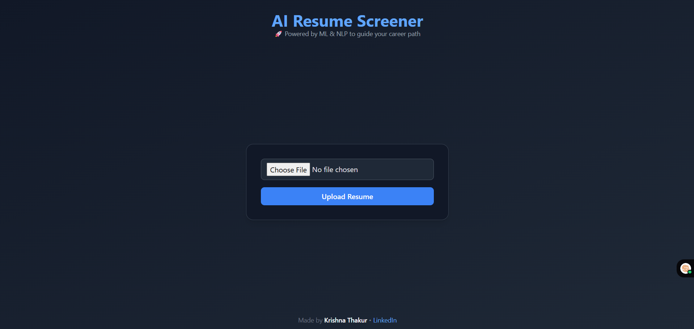
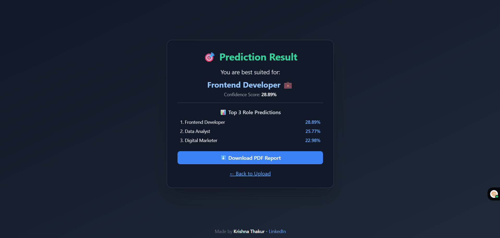

# 🧠 AI Resume Screener

An AI-powered web app that analyzes uploaded resumes (PDFs), predicts the best-fit job role using NLP + ML, and generates a detailed PDF report with confidence scores.

---

### 📌 Features
- 🔍 **PDF Resume Parsing** using NLP
- 🤖 **Job Role Prediction** using a trained Machine Learning model
- 📊 **Confidence Score + Top 3 Predictions**
- 📄 **PDF Report Generator**
- 📝 **Logs every prediction** in both `.csv` and `.log` formats
- 🌐 **Deployed using Render**
- 🎨 Beautiful UI with **Tailwind CSS**

---

### 🚀 How It Works

1. Upload a resume PDF
2. Backend extracts text from the file
3. ML model predicts the most suitable job role
4. Confidence score + report PDF is shown + downloadable

---

### 🛠️ Tech Stack
- **Backend**: Python, Flask
- **ML**: Scikit-learn, TfidfVectorizer
- **Frontend**: HTML, Tailwind CSS
- **PDF Parsing**: PyMuPDF
- **PDF Report**: FPDF
- **Deployment**: Render

---

## 📸 Screenshots

### Upload Page


### Result Page



### ⚙️ Run Locally

```bash
git clone https://github.com/your-username/AI_Resume_Screener.git
cd AI_Resume_Screener
pip install -r requirements.txt
python app.py
